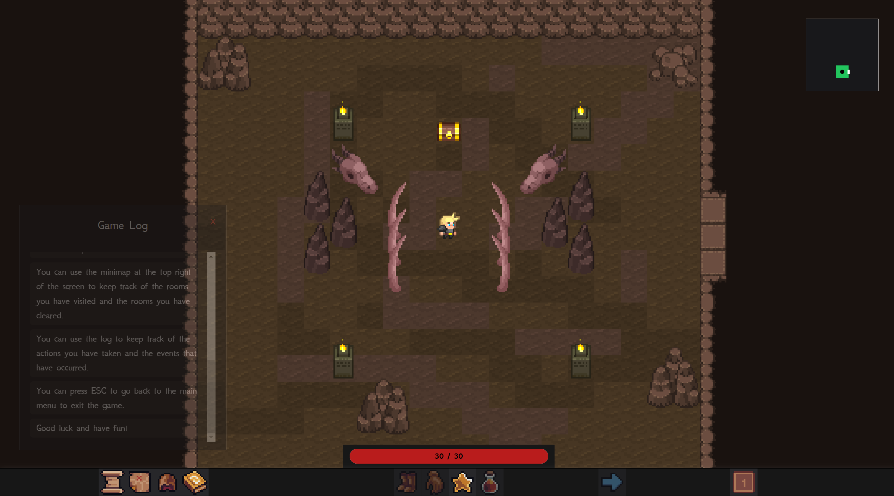
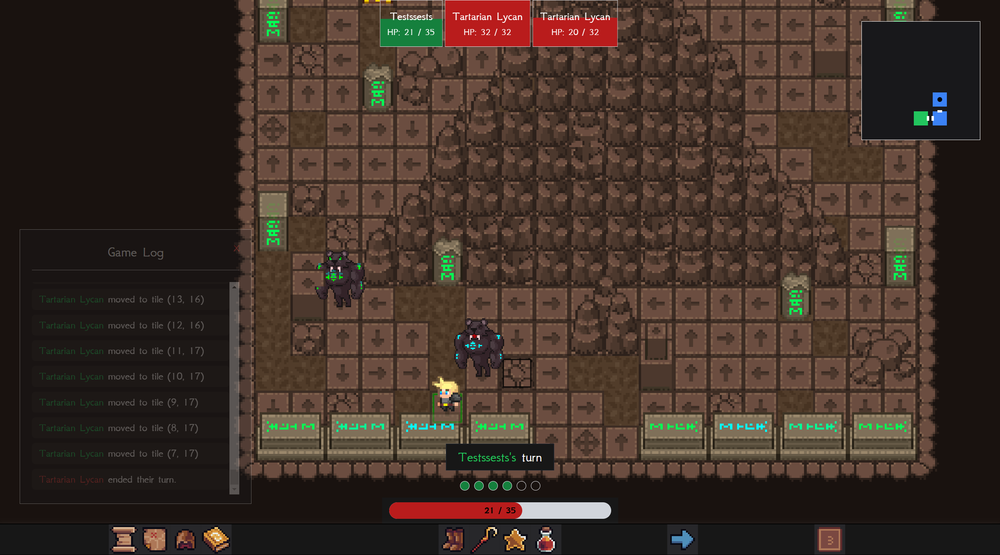
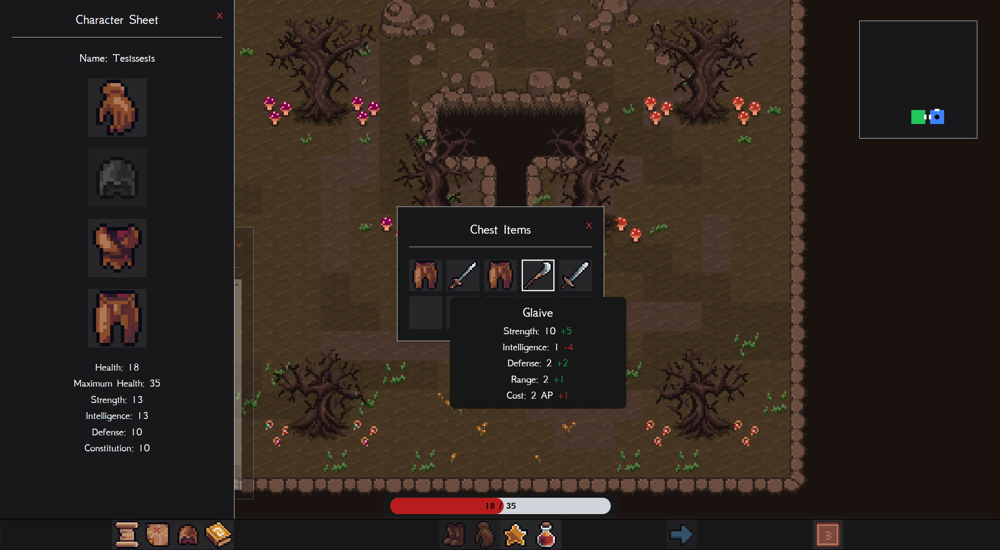
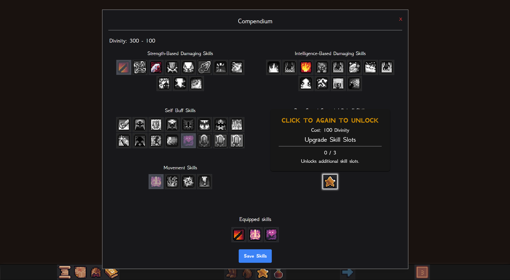

<h1 align="center">
    🏛️ Rise to Olympus
</h1>
<p align="center">Tactical Turn-Based Roguelike Web Game based on Greek Mythology</p>

<p align="center">View Demo:
<a href="https://rise-to-olympus.netlify.app/">rise-to-olympus.netlify.app</a>
</p>

<p align="center">
  <a href="#-features">Features</a>&nbsp;&nbsp;&nbsp;|&nbsp;&nbsp;&nbsp;
  <a href="#-prerequisites">Prerequisites</a>&nbsp;&nbsp;&nbsp;|&nbsp;&nbsp;&nbsp;
  <a href="#-technologies">Technologies</a>&nbsp;&nbsp;&nbsp;|&nbsp;&nbsp;&nbsp;
  <a href="#%EF%B8%8F-roadmap">Roadmap</a>&nbsp;&nbsp;&nbsp;|&nbsp;&nbsp;&nbsp;
  <a href="#-images">Images</a>&nbsp;&nbsp;&nbsp;|&nbsp;&nbsp;&nbsp;
  <!-- <a href="#%EF%B8%8F-roadmap">Walkthrough</a>&nbsp;&nbsp;&nbsp;|&nbsp;&nbsp;&nbsp; -->
  <a href="#-contributors">Contributors</a>
</p>

## ✨ Features

- **Dynamic Combat System**

  Engage in tactical turn-based battles with a variety of mythical creatures.

- **Randomly Generated Levels**

  Experience a new adventure every time with randomly chosen maps enemies.

- **Skill Progression**

  Unlock and synergize skills, learn enemy patterns and environment.

- **Regular Updates**

  Benefit from continuous improvements and new content based on player feedback.

## 📋 Prerequisites

Project Before you start, you will need to have the following tools installed on your PC/Laptop:
[Git](https://git-scm.com), [Node.js](https://nodejs.org/en/) and/or [Yarn](https://yarnpkg.com/).
In addition, it is good to have an editor to work with the code such as [VSCode](https://code.visualstudio.com/).

1. Clone the repository:

   ```bash
   git clone https://github.com/codetrifecta/rise-to-olympus.git
   cd rise-to-olympus
   ```

2. Install dependencies:

   ```bash
   npm install
   ```

3. Run the server:
   ```bash
   npm run dev
   ```

## 🚀 Technologies

This game was built with the following technologies:

- Typescript
- React
- Zustand
- Tailwind
- Vite

## 🛣️ Roadmap

- [x] Toggle button to speed up enemy actions
- [x] Upgradable passives (higher base stat, more skill slots, etc)
- [ ] Refactor obstacle and entity layering to fix entity-obstacle layering bugs
- [ ] Shop room so players can buy specific equipment
- [ ] Miniboss room for extra challenge and higher quality loot
- [ ] More floors
  - [ ] More rooms for floor 1
  - [ ] Floor 2
  - [ ] Floor 3
- [ ] Dedicated tutorial overlay
- [ ] Scripts for the story
- [ ] Sound efffects and music

## 🖼️ Images
<div align="center">

  Title Screen

   &nbsp;

  Tutorial Start Room

   &nbsp;

  Combat Scenario

   &nbsp;

  Randomized Chest Loot

   &nbsp;

  Compendium: Unlock Skills and Passives

   &nbsp;

</div>


## 👥 Contributors

- [Afuza](https://github.com/afutofu) - Tech Lead, System architect and design, UI
- [Denise](https://github.com/Detadja) - Pathfinding, Vision, Floor Rooms Generation
- [Sehyun](https://github.com/parksehyun91) - Scripts, Map creation
